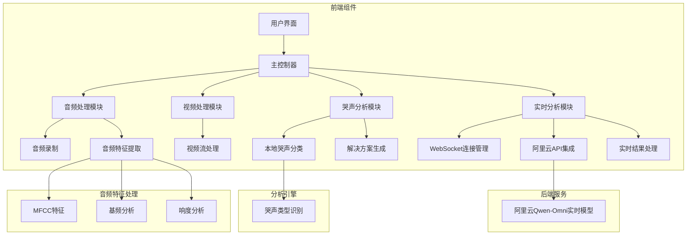
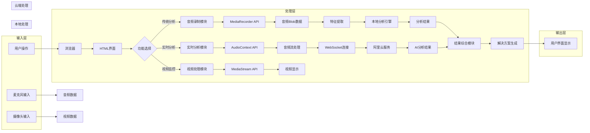

# 婴儿哭声分析器架构说明

## 架构图（Architecture Diagram）

```mermaid
graph TD
    A[用户界面] --> B[主控制器]
    B --> C[音频处理模块]
    B --> D[视频处理模块]
    B --> E[哭声分析模块]
    B --> F[实时分析模块]
    
    C --> G[音频录制]
    C --> H[音频特征提取]
    
    E --> I[本地哭声分类]
    E --> J[解决方案生成]
    
    F --> K[WebSocket连接管理]
    F --> L[阿里云API集成]
    F --> M[实时结果处理]
    
    D --> N[视频流处理]
    
    H --> O[MFCC特征]
    H --> P[基频分析]
    H --> Q[响度分析]
    
    L --> R[阿里云Qwen-Omni实时模型]
    
    I --> S[哭声类型识别]
    
    subgraph 前端组件
        A
        B
        C
        D
        E
        F
        G
        H
        I
        J
        K
        L
        M
        N
    end
    
    subgraph 音频特征处理
        O
        P
        Q
    end
    
    subgraph 后端服务
        R
    end
    
    subgraph 分析引擎
        S
    end
```

## API 调用图（API Call Graph）

```mermaid
graph TD
    A[用户点击开始录音] --> B[getUserMedia请求音频权限]
    B --> C[创建MediaRecorder实例]
    C --> D[开始音频录制]
    
    E[用户点击停止录音] --> F[停止MediaRecorder]
    F --> G[获取录制的音频Blob]
    G --> H[extractAudioFeatures]
    H --> I[classifyCryType]
    I --> J[generateSolution]
    
    K[用户点击开始实时分析] --> L[getUserMedia请求音频权限]
    L --> M[创建AudioContext]
    M --> N[创建ScriptProcessorNode]
    N --> O[onaudioprocess事件]
    O --> P[convertFloat32ToPCM16]
    P --> Q[encodeToBase64]
    Q --> R[WebSocket发送音频数据]
    
    R --> S[阿里云API处理]
    S --> T[WebSocket接收响应]
    T --> U[handleAliyunResponse]
    U --> V[更新实时分析结果]
    
    W[用户点击停止实时分析] --> X[断开WebSocket连接]
    X --> Y[combineAnalysisResults]
    Y --> Z[综合生成最终结果]
    
    subgraph 录音分析流程
        A
        B
        C
        D
        E
        F
        G
        H
        I
        J
    end
    
    subgraph 实时分析流程
        K
        L
        M
        N
        O
        P
        Q
        R
        S
        T
        U
        V
        W
        X
        Y
        Z
    end
```

## 数据流向图（Data Flow Diagram）

```mermaid
graph LR
    A[用户操作] --> B[浏览器]
    C[麦克风输入] --> D[音频数据]
    E[摄像头输入] --> F[视频数据]
    
    B --> G[HTML界面]
    G --> H{功能选择}
    
    H -->|传统分析| I[音频录制模块]
    H -->|实时分析| J[实时分析模块]
    H -->|视频监控| K[视频处理模块]
    
    I --> L[MediaRecorder API]
    L --> M[音频Blob数据]
    M --> N[特征提取]
    N --> O[本地分析引擎]
    O --> P[分析结果]
    
    J --> Q[AudioContext API]
    Q --> R[音频流处理]
    R --> S[WebSocket连接]
    S --> T[阿里云服务]
    T --> U[AI分析结果]
    
    K --> V[MediaStream API]
    V --> W[视频显示]
    
    P --> X[结果综合模块]
    U --> X
    X --> Y[解决方案生成]
    Y --> Z[用户界面显示]
    
    subgraph 输入层
        A
        C
        E
    end
    
    subgraph 处理层
        B
        G
        H
        I
        J
        K
        L
        M
        N
        O
        P
        Q
        R
        S
        T
        U
        V
        W
        X
        Y
    end
    
    subgraph 输出层
        Z
    end
    
    subgraph 本地处理
        I
        L
        M
        N
        O
        P
    end
    
    subgraph 云端处理
        J
        Q
        R
        S
        T
        U
    end
```