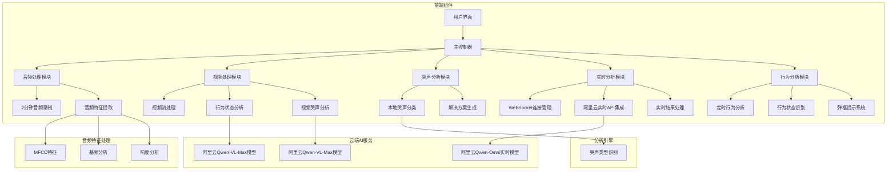

# 婴儿哭声与行为分析器架构说明

## 架构图（Architecture Diagram）



## API 调用图（API Call Graph）

```mermaid
graph TD
    A[用户点击开始录音] --> B[getUserMedia请求音频权限]
    B --> C[创建MediaRecorder实例]
    C --> D[开始2分钟音频录制]
    
    E[用户点击停止录音] --> F[停止MediaRecorder]
    F --> G[获取录制的音频Blob]
    G --> H[extractAudioFeatures]
    H --> I[classifyCryType]
    I --> J[generateSolution]
    
    K[用户点击开始实时分析] --> L[getUserMedia请求音频权限]
    L --> M[创建AudioContext]
    M --> N[创建ScriptProcessorNode]
    N --> O[onaudioprocess事件]
    O --> P[convertFloat32ToPCM16]
    P --> Q[encodeToBase64]
    Q --> R[WebSocket发送音频数据]
    
    R --> S[阿里云实时API处理]
    S --> T[WebSocket接收响应]
    T --> U[handleAliyunResponse]
    U --> V[更新实时分析结果]
    
    W[用户点击停止实时分析] --> X[断开WebSocket连接]
    X --> Y[combineAnalysisResults]
    Y --> Z[综合生成最终结果]
    
    AA[用户点击开启摄像头] --> AB[getUserMedia请求视频权限]
    AB --> AC[设置后置摄像头优先]
    AC --> AD[开始视频流]
    AD --> AE[显示视频画面]
    
    AF[定时器触发行为分析] --> AG[捕获当前视频帧]
    AG --> AH[转换为图像数据]
    AH --> AI[调用行为分析API]
    AI --> AJ[显示弹框提示]
    
    AK[用户点击分析视频] --> AL[捕获当前视频帧]
    AL --> AM[转换为图像数据]
    AM --> AN[调用哭声分析API]
    AN --> AO[更新视频分析结果]
    
    AP[综合分析模块] --> AQ[整合三种分析结果]
    AQ --> AR[生成最终解决方案]
    
    subgraph 2分钟音频分析流程
        A
        B
        C
        D
        E
        F
        G
        H
        I
        J
    end
    
    subgraph 实时分析流程
        K
        L
        M
        N
        O
        P
        Q
        R
        S
        T
        U
        V
        W
        X
        Y
        Z
    end
    
    subgraph 视频处理流程
        AA
        AB
        AC
        AD
        AE
        AF
        AG
        AH
        AI
        AJ
        AK
        AL
        AM
        AN
        AO
    end
    
    subgraph 综合分析流程
        AP
        AQ
        AR
    end

## 数据流向图（Data Flow Diagram）

```mermaid
graph LR
    A[用户操作] --> B[浏览器]
    C[麦克风输入] --> D[音频数据]
    E[摄像头输入] --> F[视频数据]
    
    B --> G[HTML界面]
    G --> H{功能选择}
    
    H -->|传统分析| I[音频录制模块]
    H -->|实时分析| J[实时分析模块]
    H -->|视频监控| K[视频处理模块]
    
    I --> L[MediaRecorder API]
    L --> M[音频Blob数据]
    M --> N[特征提取]
    N --> O[本地分析引擎]
    O --> P[分析结果]
    
    J --> Q[AudioContext API]
    Q --> R[音频流处理]
    R --> S[WebSocket连接]
    S --> T[阿里云服务]
    T --> U[AI分析结果]
    
    K --> V[MediaStream API]
    V --> W[视频显示]
    
    P --> X[结果综合模块]
    U --> X
    X --> Y[解决方案生成]
    Y --> Z[用户界面显示]
    
    subgraph 输入层
        A
        C
        E
    end
    
    subgraph 处理层
        B
        G
        H
        I
        J
        K
        L
        M
        N
        O
        P
        Q
        R
        S
        T
        U
        V
        W
        X
        Y
    end
    
    subgraph 输出层
        Z
    end
    
    subgraph 本地处理
        I
        L
        M
        N
        O
        P
    end
    
    subgraph 云端处理
        J
        Q
        R
        S
        T
        U
    end
```